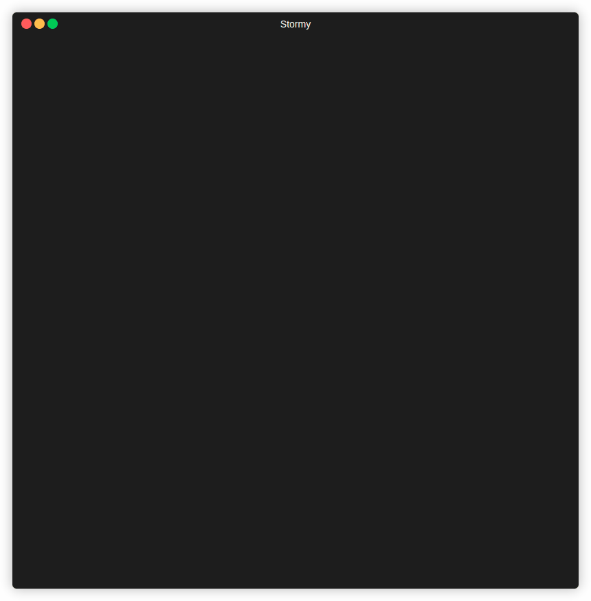

# Stormy

<center>WIP</center>

<br/><br/>
<center>A simple and user-friendly CLI to interact with your Lego Mindstorms NXT 2.0 Brick</center>
<br/><br/>


<br/><br/>


### Getting Started :

- Installation
- Options
- Usaga examples
    - Get your Lego Mindstorms NXT 2.0 Brick's information
    - Set or update your Lego Mindstorms NXT 2.0 Brick's name
    - List all files in your Lego Mindstorms NXT 2.0 Brick
    - Upload a file from your local computer to your Lego Mindstorms NXT 2.0 Brick's name
    - Download a file from your Lego Mindstorms NXT 2.0 Brick to your local computer
    - Delete a file from your Lego Mindstorms NXT 2.0 Brick

### Requirements : 

Requirements :

- [Python 3.X](http://www.python.org/)
- USB communication:
    - [PyUSB](https://github.com/pyusb/pyusb)
- Bluetooth communication:
    - [PyBluez](https://github.com/pybluez/pybluez)
- Python NXT library
    - [nxt-python](https://github.com/schodet/nxt-python)


### Installation :

To use **stormy** you should already have python version 3 installated on your system.

```bash
python3 -m pip install --upgrade stormy
```

### Options :

To see what **stormy** can do form you, you can use the `--help` parameter


### Usage :

- Get your Lego Mindstorms NXT 2.0 Brick's information


- Set or update your Lego Mindstorms NXT 2.0 Brick's name


- List all files in your Lego Mindstorms NXT 2.0 Brick



- Upload a file from your local computer to your Lego Mindstorms NXT 2.0 Brick's name


- Download a file from your Lego Mindstorms NXT 2.0 Brick to your local computer


- Delete a file from your Lego Mindstorms NXT 2.0 Brick


